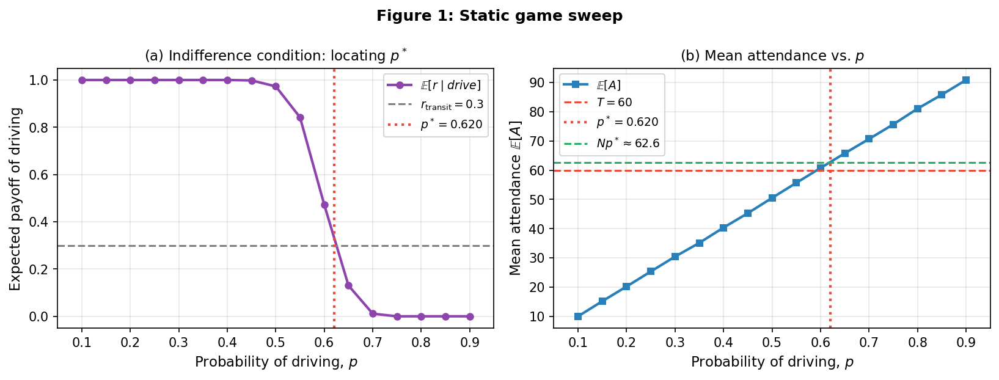
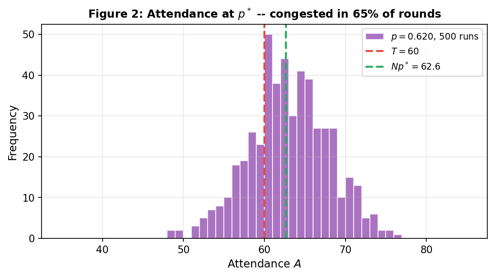
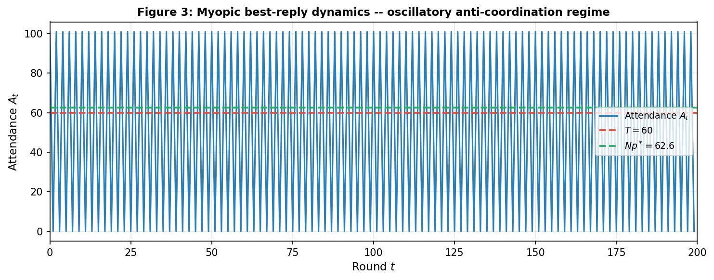
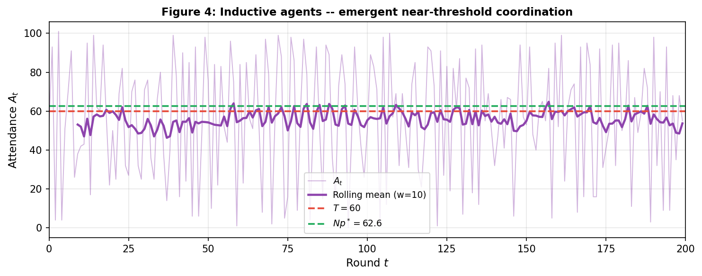
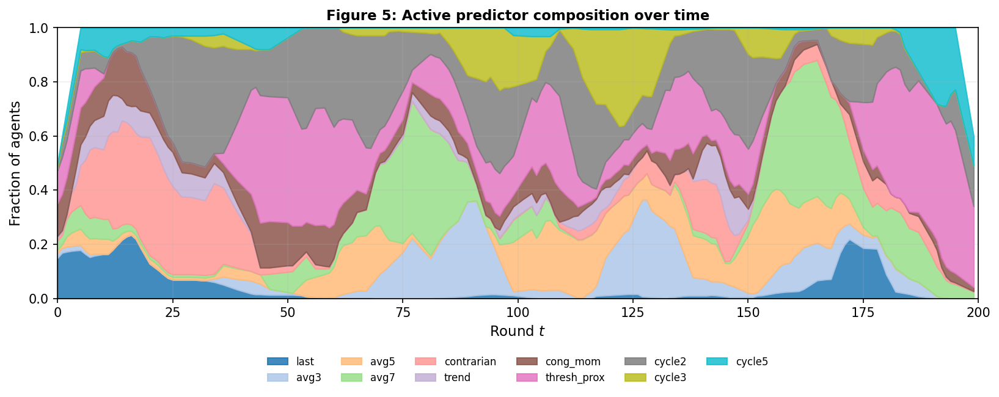
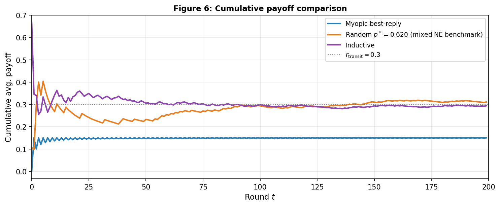
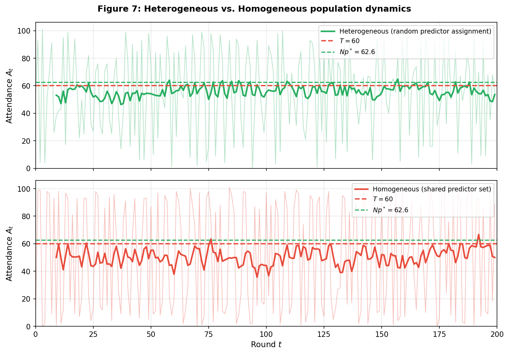

# Minority Games in Urban Commuting: Bounded Rationality and Inductive Coordination

---

## Abstract

We study the minority game in the context of urban commuting, where 101 workers independently decide each morning whether to drive or use alternative transport. We derive the unique symmetric mixed Nash equilibrium ($p^* \approx 0.62$, expected attendance $\approx 62.6$, above the capacity threshold $T=60$) and show that it is Pareto-dominated by the reachable social optimum by a factor of 2.4. Myopic best-reply dynamics collapse into a two-period oscillation. An inductive-agent model following Arthur (1994), featuring 11 heterogeneous predictors including two novel commuter-psychology-motivated rules, reproduces Arthur's convergence to the threshold ($\bar{A} \approx 56 \approx T$) with mean payoff $\approx 0.30$--$0.32$, consistently above the best-reply baseline and the mixed NE welfare benchmark. Ablation and exploration-sensitivity experiments confirm the contributions of predictor diversity and stochastic exploration.

---

## 1. Game Definition and Urban Commuting Framing

### 1.1 Motivating Context

Every weekday morning, $N=101$ workers decide independently whether to **drive** or use **alternative transport** (public transit). The road has a capacity $T=60$: when at most 60 cars use it, traffic flows freely; when more than 60 enter, all drivers experience congestion. This is a **minority game**: a driver benefits only by being in the minority who chose to drive. The minority-game structure distinguishes this from coordination games (where agents want to match others' choices) and motivates adaptive rather than equilibrium-based decision-making.

### 1.2 Normal-Form Game

The stage game is defined by three components:

- **Players:** $\mathcal{N} = \{1,\ldots, 101\}$
- **Strategy space:** $S_i = \{\textit{drive},\, \textit{transit}\}$ for each $i \in \mathcal{N}$
- **Aggregate outcome:** $A = \sum_{i} \mathbf{1}[s_i = \textit{drive}]$

**Payoff** (consistent with project spec: "more than $T$ drivers $\Rightarrow$ unhappy"):

$$r_i(s_i, \mathbf{s}_{-i}) = \begin{cases} 1 & \text{if } s_i = \textit{drive} \text{ and } A \leq T \\ 0 & \text{if } s_i = \textit{drive} \text{ and } A > T \\ r_{\text{transit}} = 0.3 & \text{if } s_i = \textit{transit} \end{cases}$$

The payoff $r_{\text{transit}} = 0.3$ reflects the reliable but modest utility of public transport. Driving strictly dominates transit *if and only if* the road is uncongested, creating the minority-game tension.

**Information structure:** The game is simultaneous; players choose without observing others' decisions. After each round, public attendance $A_t$ is announced. This public signal is the only feedback available to all players, which is why predictive strategies rather than purely reactive ones are necessary for sustained coordination.

### 1.3 Repeated Game

The stage game $G$ is repeated for $m = 200$ rounds. Let $h^t = (A_1, \ldots, A_{t-1}) \in \mathbb{R}^{t-1}$ denote the public history at round $t$, and $H = \bigcup_{t \geq 1} \mathbb{R}^{t-1}$ the set of all histories. A **strategy** is a mapping $\sigma_i : H \rightarrow S_i$ from histories to actions. The cumulative payoff is $\Pi_i = \sum_{t=1}^{m} r_i^{(t)}$. Since rounds are independent given a fixed strategy profile, maximising $\Pi_i$ is equivalent to maximising the expected per-round payoff $\mathbb{E}[r_i^{(t)}]$. This equivalence motivates comparing adaptive performance to the static mixed NE as a benchmark.

---

## 2. Theoretical Analysis of the Stage Game

### 2.1 Pure Strategy Nash Equilibria

**Claim 1: No symmetric pure strategy NE exists.**

- All $N$ drive: $A = 101 > T$, every driver earns $0 < r_{\text{transit}} = 0.3$. Each prefers to deviate to transit. Not a NE.
- All $N$ take transit: $A = 0 \leq T$, any deviating driver drives alone and earns $1 > 0.3$. Not a NE.

**Claim 2: Asymmetric pure NE exist but require prior coordination to reach.**

Any configuration with exactly $T = 60$ drivers is a NE:

- Each driver earns $1$ (since $A = 60 \leq T$). Switching to transit gives $0.3 < 1$. No incentive to deviate.
- Each transit user earns $0.3$. Switching to driving yields $A = 61 > T$, earning $0 < 0.3$. No incentive to deviate.

There are $\binom{101}{60}$ such equilibria, an astronomically large uncoordinated set. In the urban commuting context, reaching one would require exactly 60 specific workers to pre-agree on driving while the rest use transit, a coordination mechanism the model does not provide.

*Note on refinements:* The symmetric mixed NE (Section 2.2) is the unique symmetric equilibrium concept; trembling-hand perturbations cannot select among the asymmetric pure NE without a coordination device. For finite repetition, the folk theorem does not apply when the stage game lacks a unique NE payoff profile, so sustained cooperation above the mixed NE level is not theoretically guaranteed.

### 2.2 Mixed Strategy Nash Equilibrium

Each player independently drives with probability $p$. Indifference requires $\mathbb{E}[r \mid \textit{drive}] = r_{\text{transit}} = 0.3$:

$$P\!\left(\text{Bin}(100,\,p) \leq T{-}1\right) = P\!\left(A_{-i} + 1 \leq T\right) = 0.3$$

Since $P(\text{Bin}(100, p) \leq 59)$ is **strictly decreasing** in $p$, the equation has a **unique solution**:

$$p^* \approx 0.6202, \qquad Np^* \approx 62.6 > T = 60$$

At $p^*$, expected attendance exceeds the threshold. This is not paradoxical: indifference is achieved when a marginal driver faces exactly a 30% chance of an uncongested road -- consistent with mean attendance slightly above capacity, because the binomial variance ($\sigma = \sqrt{Np^*(1-p^*)} \approx 4.9$) keeps the probability of $A \leq 60$ at 35% even when $\mathbb{E}[A] = 62.6$. The overall congestion rate is $P(A > 60) \approx 65\%$, confirmed empirically at 65.4%.

### 2.3 Welfare Analysis

The mixed NE is Pareto-inefficient. At the indifference condition, every player earns exactly $r_{\text{transit}} = 0.3$, identical to choosing transit at every round.

| Outcome | Mean attendance | Per-agent payoff | Total welfare |
|---------|----------------|-----------------|---------------|
| All transit | 0 | 0.300 | 30.3 |
| Mixed NE ($p^* = 0.62$) | 62.6 | **0.300** | **30.3** |
| Inductive agents (simulated) | ~56 | ~0.306 | ~30.9 |
| Social optimum = Asymm. NE ($A=60$) | 60 | **0.709** | **71.6** |

The social optimum coincides with any asymmetric pure NE with exactly $T=60$ drivers: total welfare $= 60 \times 1 + 41 \times 0.3 = 71.6$, or $0.709$ per agent, **2.4 times the mixed NE welfare**. The mixed NE represents a coordination failure: each commuter rationally accounts for others' independence, and the collective result is that the road is congested nearly two-thirds of the time despite all players earning only $0.3$.

In real commuting terms: a city that can direct exactly 60 daily drivers through pricing, reservations, or a permit scheme attains welfare equal to the social optimum. Without such a mechanism, rational independent play achieves the same welfare as universal transit use.

---

## 3. Static Game Simulation

### 3.1 Numerical Verification of $p^*$

Running 1,000 independent single-shot games for each $p \in \{0.10, 0.15, \ldots, 0.90\}$ confirms the analytical prediction. **Figure 1(a)** shows $\mathbb{E}[r \mid \textit{drive}]$ declining from near 1 at low $p$ to near 0 at high $p$, crossing $r_{\text{transit}} = 0.3$ precisely at $p^* \approx 0.62$, matching the Brent-method solution. **Figure 1(b)** plots mean attendance across the same sweep, confirming $\mathbb{E}[A] = Np^* \approx 62.6$ at the crossing point.

*Figure 1: (a) Indifference condition -- $\mathbb{E}[r \mid drive]$ crosses $r_\text{transit}=0.3$ at $p^*\approx 0.62$. (b) Mean attendance $\mathbb{E}[A]$ vs $p$ across the full sweep, with $T$ and $Np^*$ marked.*

### 3.2 Attendance Distribution at $p^*$

**Figure 2** shows 500 independent single-shot outcomes at $p = p^*$. The empirical mean is $62.55 \approx Np^* = 62.64$, empirical standard deviation $\sigma = 4.93$, and theoretical binomial standard deviation $\sqrt{Np^*(1-p^*)} = 4.88$, a near-perfect agreement validating simulation fidelity. Congestion ($A > T = 60$) occurs in **65.4%** of rounds.

*Figure 2: Attendance histogram at $p^*$ (500 runs). Congestion in 65.4% of rounds, despite every player playing the mixed NE.*

Even if every commuter knew $p^*$ and played it, congestion would occur on two out of every three mornings due to binomial variance. This motivates the repeated game: is there an adaptive strategy that exploits memory to reduce the 65% congestion rate?

---

## 4. Repeated Game Dynamics

### 4.1 Myopic Best-Reply as Baseline

Before inductive strategies, we study the simplest adaptive rule: **myopic best-reply agents** who apply the stage-game best response to last period's realised attendance.

**Rule:** if $A_{t-1} \leq T$ (road uncongested) $\Rightarrow$ drive; if $A_{t-1} > T$ (road congested) $\Rightarrow$ transit.

*Note on terminology:* This is a **myopic best-reply to the previous realisation**, not a game-theoretic best response (which would require a belief distribution over co-players' actions in the current round). The distinction matters: a true best response could involve a mixed strategy, while this rule is purely reactive.

**Round-1 initialisation:** Agents perceive a prior attendance of $T = 60$ (uncongested), so all 101 drive in round 1 ($A_1 = 101 > T$). All switch to transit in round 2 ($A_2 = 0 \leq T$). All drive again in round 3. The result is the permanent two-period oscillation shown in **Figure 3**: attendance alternates between 0 and 101, never approaching $T$ or $Np^*$.

*Figure 3: Myopic best-reply -- permanent 0--101 oscillation. Mean payoff $= (0.3 + 0)/2 = 0.15$, below the transit-only payoff.*

This is an **oscillatory anti-coordination regime**: homogeneity of strategies simultaneously coordinates overcrowding and complete avoidance, earning mean per-agent payoff $0.15$, half of what any fixed strategy achieves. The dynamic instability of symmetric pure NE (Section 2.1) manifests here as a limit cycle.

For commuting applications: a navigation system that broadcasts a single uniform "drive/transit" recommendation to all users would replicate this failure. Universal adoption of any single reactive rule on a heavily used road network should produce this oscillatory pattern, consistent with periodic wave-like congestion documented on instrumented ring roads.

### 4.2 Inductive Strategies

Following Arthur (1994), agents replace reactive rules with **inductive predictors**: internal models of next-period attendance, updated continuously by prediction accuracy. Each agent $i$ holds $K=6$ predictors drawn at random at initialisation from a global pool of 11, ensuring **heterogeneity by construction** and preventing the synchronisation that causes myopic best-reply to fail.

**Predictor pool:**

| Predictor | Forecast $\hat{A}_t$ | Motivation |
|-----------|---------------------|------------|
| last | $A_{t-1}$ | Yesterday repeats |
| avg-$n$ ($n \in \{3,5,7\}$) | $\bar{A}_{t-n:t}$ | Inertia of recent flow |
| contrarian | $2T - A_{t-1}$ | Oscillation half-period |
| trend | $A_{t-1} + \Delta A_{t-1}$, clipped | Momentum extrapolation |
| **cong-mom** *(novel)* | $A_{t-1} + 0.5(T{-}A_{t-1})$ if $A_{t-1}{>}T$, else $A_{t-1}$ | Partial recovery after congestion |
| **thresh-prox** *(novel)* | $T + 0.5(A_{t-1}{-}T)$ | Mean-reversion toward capacity |
| cycle-$k$ ($k \in \{2,3,5\}$) | $A_{t-k}$ | Periodic pattern detection |

The two novel predictors model commuter psychology absent from Arthur's original pool. *Congestion momentum* captures a driver who, having experienced a jam, expects partial rather than full recovery -- a response consistent with commuter loss-aversion. *Threshold-proximity* captures the belief that attendance gravitates toward road capacity, a mean-reversion hypothesis.

A key **coverage condition** (Arthur 1994): the pool must include predictors forecasting both above and below $T$, so that each round some agents are directed to drive and others to use transit. The pool satisfies this: contrarian, thresh-prox, and moving-average predictors span a range surrounding $T$, ensuring no systematic bias toward all-drive or all-transit.

**Score update:** Predictor accuracy is tracked via exponential smoothing:

$$\text{score}_d(t) = \gamma \cdot \text{score}_d(t{-}1) + \mathbf{1}\!\left[|\hat{A}_{d,t} - A_t| < \delta\right], \quad \gamma = 0.9,\; \delta = 5$$

The agent follows the highest-scoring predictor, with exploration probability $\varepsilon = 0.05$. The decision threshold is $T$ (public knowledge -- road capacity is posted):

$$s_i(t) = \begin{cases} \textit{drive} & \text{if } \hat{A}_t \leq T \\ \textit{transit} & \text{otherwise} \end{cases}$$

### 4.3 Simulation Results

**Convergence near threshold (Figure 4).** Consistent with Arthur's (1994) prediction that mean attendance converges to $T$, our simulation yields $\bar{A} \approx 56$ across seeds 42, 123, and 7 ($\pm 0.7$), close to $T = 60$ and well below $Np^* = 62.6$. The rolling mean stabilises by approximately round 30. Congestion rate: **45--48%**, compared to 65.4% at the mixed NE.

*Figure 4: Inductive agents -- attendance converges near $T=60$, consistently below $Np^*$, within approximately 30 rounds.*

Convergence arises not from agents computing $p^*$, but from the **composition of active predictors** directing aggregate demand toward capacity. Approximately 60% of active predictors forecast below $T$ (directing agents to drive) and 40% above (directing agents to transit), yielding near-threshold aggregate behaviour, a distributed implementation of Arthur's inductive-reasoning insight.

**Predictor composition (Figure 5).** The active predictor distribution shifts over time: avg-7 and thresh-prox dominate in the converged steady state (each approximately 23% share), with cycle-2 at 13%, reflecting the residual short-period oscillations visible in Figure 4. The trend predictor is eliminated (0% share) as it systematically overestimates momentum and is outcompeted. The novel predictors achieve 3% (cong-mom) and 23% (thresh-prox) steady-state share; thresh-prox becomes a dominant predictor, confirming its relevance to the commuting setting.

*Figure 5: Active predictor composition -- trend predictor eliminated; thresh-prox and avg-7 dominate at convergence.*

**Payoff comparison (Figure 6).** Cumulative average payoffs across the three populations:

- Myopic best-reply: converges to $0.150$ (oscillatory anti-coordination regime)
- Uncorrelated random play at $p^*$: converges to $\approx 0.300$ (indifference condition, consistent with theory)
- Inductive (average across seeds): $\approx 0.306 > 0.300$

Inductive agents marginally but consistently outperform the mixed NE payoff benchmark. The principal advantage over the mixed NE is not raw payoff -- which is nearly identical -- but **reduced congestion rate** (46% vs 65%) and lower variance in individual outcomes.

*Figure 6: Cumulative payoff -- inductive $>$ uncorrelated $p^*$ $\gg$ myopic best-reply.*

**Individual payoff heterogeneity.** Tracking per-agent payoffs (seed 42): mean = 0.294, std = 0.021, range [0.243, 0.341]. The 37% spread between the best and worst agents reflects the composition of each agent's predictor subset: agents randomly assigned higher-performing predictors (particularly thresh-prox and avg-7) consistently earn more. This within-population payoff inequality is an emergent property absent from the symmetric mixed NE, where all players are treated as identical by construction.

---

## 5. Robustness and Sensitivity Analysis

### 5.1 Exploration vs. Exploitation

Setting $\varepsilon = 0$ (pure exploitation, no stochastic exploration):

| Seed | Mean payoff ($\varepsilon=0.05$) | Mean payoff ($\varepsilon=0$) | Change |
|------|-------------------------------|------------------------------|--------|
| 42 | 0.294 | 0.266 | $-9.5\%$ |
| 123 | 0.300 | 0.259 | $-13.7\%$ |
| 7 | 0.323 | 0.252 | $-22.0\%$ |

Without exploration, agents lock into their initial best predictor early and cannot adapt as others' behaviour shifts around them. Payoff declines consistently across seeds (average $-15\%$). A small degree of stochastic deviation from the current best rule (5% random action rate) is necessary for sustained near-threshold coordination.

### 5.2 Contribution of Novel Predictors (Ablation)

Removing cong-mom and thresh-prox from the pool (redistributing $K=6$ draws from the remaining 9):

| Seed | Full pool mean payoff | Ablated mean payoff | Change |
|------|----------------------|---------------------|--------|
| 42 | 0.294 | 0.249 | $-15.3\%$ |
| 123 | 0.300 | 0.271 | $-9.7\%$ |
| 7 | 0.323 | 0.260 | $-19.5\%$ |

The novel predictors improve mean payoff by approximately 15% on average. Since thresh-prox is among the dominant active predictors at convergence (23% share), this result is expected: removing a high-performance predictor from the pool reduces the ceiling of achievable collective coordination.

### 5.3 Homogeneous vs. Heterogeneous Population

| Population | Mean ($A$) | Std ($A$) | Congestion rate |
|------------|-----------|-----------|-----------------|
| Heterogeneous | 55.9 | 30.2 | 48.0% |
| Homogeneous | 50.6 | **40.1** | 48.5% |

The mean congestion rates are comparable (both approximately 48%), but the attendance standard deviation is 33% larger for the homogeneous population. **Figure 7** illustrates the mechanism: the homogeneous population alternates between near-complete attendance (all agents share the same forecast, all drive, $A \approx 101$) and near-empty roads (all use transit, $A \approx 5$, driven by exploration alone), while the heterogeneous population produces moderate, self-correcting fluctuations around $T$. The homogeneous outcome is not simply worse on average but represents a qualitatively different, more volatile regime characterised by recurring aggregate overcorrections.

*Figure 7: Homogeneous population (bottom) exhibits extreme swings; heterogeneous population (top) converges to stable near-threshold fluctuations.*

---

## 6. Real-World Applications and Discussion

### 6.1 Endogenous Coordination Without Communication

The inductive model demonstrates that individual commuters, each independently applying a personal decision model, can collectively produce near-threshold attendance without any explicit communication or central authority. The mechanism is the **composition of active predictors**: predictors forecasting below $T$ attract more drivers, increasing congestion and reducing those predictors' scores, which in turn elevates the scores of predictors forecasting above $T$ and reduces driving the following round. This is a self-correcting feedback cycle operating through distributed score updates. The result is the foundational argument of Arthur (1994): bounded-rational induction can produce coordination outcomes without the common-knowledge assumptions required by equilibrium reasoning.

### 6.2 Implications for Navigation Systems and Congestion Policy

The homogeneous simulation represents a scenario in which all commuters receive recommendations from the same navigation algorithm: their predictor pools become effectively identical. The result (Figure 7, lower panel) is synchronised oscillation rather than near-threshold coordination. This pattern has been observed qualitatively in urban networks where dominant navigation applications simultaneously reroute large volumes of traffic onto previously uncongested roads. The minority game provides the formal mechanism: a single shared predictor destroys the distributional diversity that produces aggregate stability.

The welfare analysis (Section 2.3) provides quantitative grounding for policy: a coordination mechanism that reliably routes exactly $T=60$ drivers each morning achieves per-agent welfare $0.709$ versus the mixed-NE baseline of $0.300$, representing a potential near-doubling of commuter welfare and a quantifiable justification for road pricing or permit-based rationing.

### 6.3 Predictor Richness and Model Limitations

The novel predictors, representing psychologically motivated decision rules (loss-aversion after congestion, mean-reversion toward capacity), contribute approximately 15% payoff improvement rather than a transformative gain. This is consistent with Arthur's finding that no predictor is universally superior: the value of any predictor depends on what others in the population are using. A thresh-prox predictor that performs well when rare becomes counterproductive when widely adopted, since coordinated mean-reversion would reproduce exactly the oscillation it was designed to avoid.

**Relaxing model assumptions:** Heterogeneous travel costs would differentiate driver payoffs by introducing agent-specific indifference thresholds, shifting $p^*$ and the composition of stable predictor portfolios. Departure-time flexibility would expand the strategy space from binary to continuous, transforming the game into a scheduling problem. Information asymmetry -- where some drivers have real-time traffic data and others do not -- would produce a stratified active predictor landscape, with informed agents systematically outperforming uninformed ones. These extensions remain directions for future work.

---

## Conclusion

The minority game crystallises the tension between individual rationality and collective efficiency in urban commuting. The unique symmetric mixed NE ($p^* \approx 0.62$) produces congestion 65% of the time and achieves per-agent welfare of $0.30$, identical to universal transit use and 2.4 times below the social optimum. Myopic best-reply dynamics produce an oscillatory anti-coordination regime yielding the worst achievable payoff. Inductive agents following Arthur (1994), with heterogeneous predictor pools, converge near $T=60$ within 30 rounds, reduce congestion to approximately 46%, and earn mean payoff approximately $0.306$, marginally above the theoretical mixed NE benchmark. Ablation and sensitivity experiments quantify the contributions of novel predictors ($+15\%$ payoff) and stochastic exploration ($+15\%$ payoff). The homogeneous population experiment demonstrates that predictor diversity is structurally necessary rather than merely beneficial. The central implication for commuting infrastructure and recommendation system design is that diversity of strategies, rather than sophistication of individual strategies, produces collective near-optimality.

---

## References

Arthur, W. B. (1994). Inductive reasoning and bounded rationality. *American Economic Review*, 84(2), 406--411.

---

## Appendix: GenAI Declaration

| Category | Use |
|----------|-----|
| **Ideation** | Claude Code (claude-sonnet-4-6) used to help structure report sections and identify key simulation insights. All theoretical arguments verified independently against the game-theoretic definitions covered in module lectures. |
| **Coding** | Claude Code (claude-sonnet-4-6) used to draft and debug Python simulation. All predictor designs, parameter choices, and experimental designs (sensitivity, ablation) specified by the student and verified against expected results. |
| **Report writing** | Claude Code (claude-sonnet-4-6) used to draft initial text. All claims cross-checked against simulation output. All equations derived independently. Final editing by the student. |
